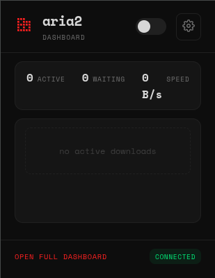
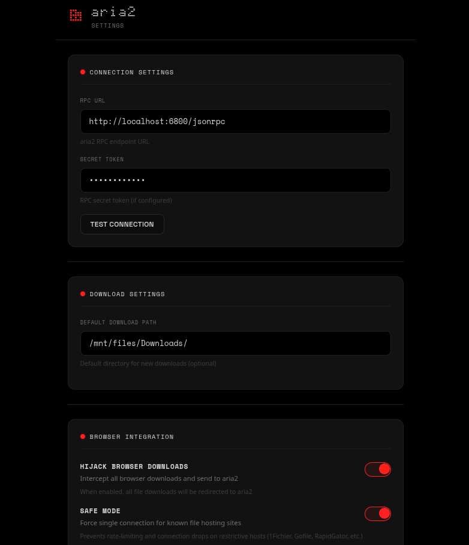

# Aria2 Dashboard

A Chrome extension for managing aria2 downloads with a sleek dot-matrix aesthetic.





## Features

- **Download Management**: View, pause, resume, stop, and remove downloads
- **Browser Integration**: Hijack browser downloads and send them directly to aria2
- **Multiple Views**: Popup panel, full dashboard, and options page
- **Dot-Matrix Aesthetic**: Clean dark theme with monospace fonts and red accents
- **Toggleable Hijacking**: Enable/disable browser download interception
- **RPC Authentication**: Support for aria2 secret tokens
- **Cookie Forwarding**: Automatically sends cookies and referrer to aria2 for authenticated downloads

## Installation

### From Source

1. Clone this repository
2. Open Chrome and go to `chrome://extensions/`
3. Enable "Developer mode"
4. Click "Load unpacked"
5. Select the extension folder

## Configuration

1. Make sure aria2 is running with RPC enabled:
   ```bash
   aria2c --enable-rpc --rpc-listen-port=6800
   ```

2. Click the extension icon and open Options
3. Set your RPC URL (default: `http://localhost:6800/jsonrpc`)
4. Enter your secret token if configured
5. Test the connection

## Usage

### Popup Panel
- Quick view of active downloads
- Compact stats (active, waiting, speed)
- Toggle download hijacking
- Action buttons for each download

### Full Dashboard
- Complete download management
- Tabbed interface (active/waiting/stopped)
- Settings panel for RPC configuration
- Real-time updates

### Download Hijacking
Enable "Hijack Downloads" to intercept browser downloads and send them to aria2 automatically.

**How it works:**
- Uses the `chrome.downloads` API to intercept all browser downloads
- Extracts cookies via the `chrome.cookies` API and forwards them to aria2
- Sends referrer and cookie headers so authenticated sites (e.g. GoFile) work correctly
- Can also right-click any link and select "Download with aria2"

## File Structure

```
├── manifest.json      # Extension manifest
├── background.js      # Service worker for download interception and RPC
├── popup.html/js      # Popup panel
├── options.html/js    # Options page
├── full.html/js       # Full dashboard
├── style.css          # Styles (dot-matrix theme)
└── icons/             # Extension icons
```

## Permissions

- `storage`: Save settings
- `activeTab`: Browser integration
- `contextMenus`: Right-click download option
- `notifications`: Download status notifications
- `downloads`: Download interception
- `cookies`: Access cookies for authenticated downloads
- `host_permissions`: Connect to aria2 RPC and access cookies from all sites

## License

MIT

## Troubleshooting

### Downloads failing on certain sites
The extension captures downloads via the `chrome.downloads` API and forwards cookies automatically. If a site still fails:
- Try using the context menu (right-click → "Download with aria2")
- Ensure the "Hijack Downloads" toggle is enabled
- Check that aria2 is running and connected

### aria2 not connecting
- Ensure aria2 is running with RPC enabled: `aria2c --enable-rpc`
- Check the RPC URL in extension options (default: `http://localhost:6800/jsonrpc`)
- Verify firewall settings allow connections to the RPC port

## Credits

- Fonts: Space Mono, Space Grotesk (Google Fonts)
