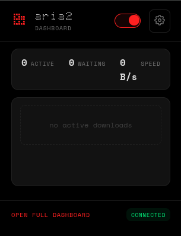
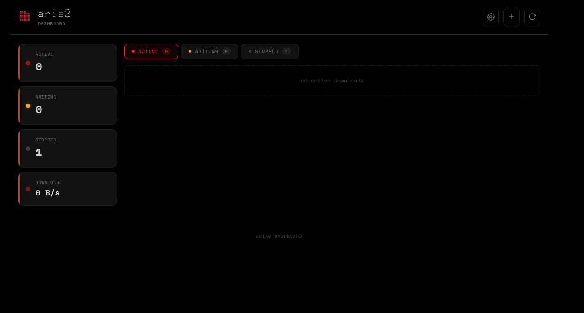

# Aria2 Dashboard

A Chrome extension for managing aria2 downloads with a sleek dot-matrix aesthetic and real-time updates.






## Features

- **Real-Time Updates**: Live download progress, speed, and status — refreshes continuously via recursive polling
- **Download Management**: View, pause, resume, stop, and remove downloads
- **Browser Integration**: Hijack browser downloads and send them directly to aria2
- **Badge Notifications**: Active download count shown on the extension icon
- **Site Interception**: Auto-detect download URLs from 30+ file hosting sites (Gofile, 1Fichier, Pixeldrain, MediaFire, RapidGator, etc.)
- **Safe Mode**: Toggle to force single-connection downloads for rate-limited hosts — prevents 429 errors and connection drops
- **Multiple Views**: Popup panel, full dashboard, and options page
- **Dot-Matrix Aesthetic**: Clean dark theme with monospace fonts and red accents
- **Toggleable Hijacking**: Enable/disable browser download interception
- **RPC Authentication**: Support for aria2 secret tokens
- **Cookie Forwarding**: Automatically sends cookies and referrer to aria2 for authenticated downloads

## Installation

### From Source

1. Clone this repository
2. Open Chrome and go to `chrome://extensions/`
3. Enable "Developer mode"
4. Click "Load unpacked"
5. Select the extension folder

## Configuration

1. Make sure aria2 is running with RPC enabled:
   ```bash
   aria2c --enable-rpc --rpc-listen-port=6800
   ```

2. Click the extension icon and open Options
3. Set your RPC URL (default: `http://localhost:6800/jsonrpc`)
4. Enter your secret token if configured
5. Test the connection

### Safe Mode

When enabled (default), downloads from known restrictive file hosts are sent to aria2 with:
- `max-connection-per-server: 1` — single connection to avoid rate limits
- `split: 1` — no chunk splitting
- `enable-http-pipelining: false` — prevents connection drops on some CDNs

This prevents 429 (Too Many Requests) errors and connection drops that occur when aria2's optimized multi-connection settings hammer rate-limited servers.

Disable Safe Mode if you want aria2 to use your full optimized config for all downloads.

## Usage

### Popup Panel
- Quick view of active and waiting downloads
- Compact stats (active, waiting, speed)
- Toggle download hijacking
- Action buttons for each download (pause, resume, stop, reorder)

### Full Dashboard
- Complete download management
- Tabbed interface (active/waiting/stopped)
- Reorder waiting downloads (move up/down in queue)
- Settings panel for RPC configuration
- Real-time updates

### Download Hijacking
Enable "Hijack Downloads" to intercept browser downloads and send them to aria2 automatically.

**How it works:**
- Uses the `chrome.downloads` API to intercept browser downloads
- Content script monitors fetch/XHR responses for hidden download URLs from file hosting sites
- Extracts cookies via the `chrome.cookies` API and forwards them to aria2
- Sends referrer and cookie headers so authenticated sites (e.g. Gofile) work correctly
- Right-click any link and select "Download with aria2"

### Supported File Hosts (Site Interception)

The content script scans fetch/XHR responses for download URLs from these hosts:

1Fichier, Bowfile, Chomikuj, ClickNUpload, DailyUploads, DataNodes, DayUploads, DL.Free, DownMediaLoad, FileBin, FileDitch, FreedLink, Gofile, HexLoad, 1CloudFile, MediaFire, Mega, MegaUp, MixDrop, NitroFlare, Oshi.at, osu!ppy, Pixeldrain, RapidGator, Ranoz, SwissTransfer, Tmpfiles, UploadNow, UsersDrive, VikingFile, WDHO

To add a new site, add a regex pattern to `siteInterceptors` in `content.js` and add the hostname to `safeModeHosts` in `background.js` if it's rate-limited.

## File Structure

```
├── manifest.json      # Extension manifest
├── background.js      # Service worker for download interception and RPC
├── content.js         # Content script for site-specific URL interception
├── popup.html/js      # Popup panel
├── options.html/js    # Options page
├── full.html/js       # Full dashboard
├── style.css          # Styles (dot-matrix theme)
└── icons/             # Extension icons
```

## Permissions

- `storage`: Save settings
- `activeTab`: Browser integration
- `contextMenus`: Right-click download option
- `notifications`: Download status notifications
- `downloads`: Download interception
- `cookies`: Access cookies for authenticated downloads
- `alarms`: Reserved for scheduled tasks
- `host_permissions`: Connect to aria2 RPC and access cookies from all sites

## License

MIT

## Troubleshooting

### Downloads failing on certain sites
- Enable **Safe Mode** in options — this forces single-connection downloads for known restrictive hosts
- Try using the context menu (right-click → "Download with aria2")
- Ensure the "Hijack Downloads" toggle is enabled
- Check that aria2 is running and connected

### Downloads going to wrong directory
- Set the download path in the extension options page
- If empty, aria2 uses its own `dir` config from `aria2.conf`

### aria2 not connecting
- Ensure aria2 is running with RPC enabled: `aria2c --enable-rpc`
- Check the RPC URL in extension options (default: `http://localhost:6800/jsonrpc`)
- Verify firewall settings allow connections to the RPC port

### Badge not updating
- Badge shows the active download count and updates when the popup or full dashboard is open
- Close and reopen the popup to trigger a refresh if the count seems stale

## Credits

- Fonts: Space Mono, Space Grotesk (Google Fonts)
- Aria2: [aria2/aria2](https://github.com/aria2/aria2)
- aria2-integration-extension [baptistecdr/aria2-integration](https://github.com/baptistecdr/aria2-integration)
