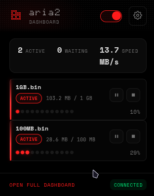
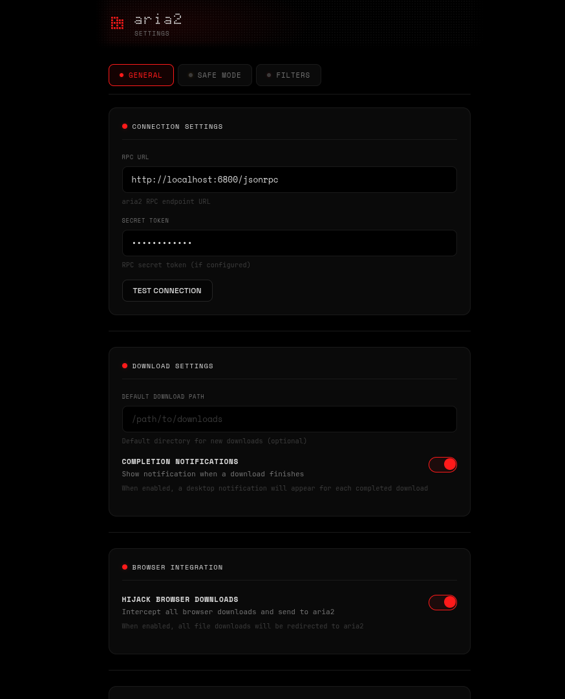
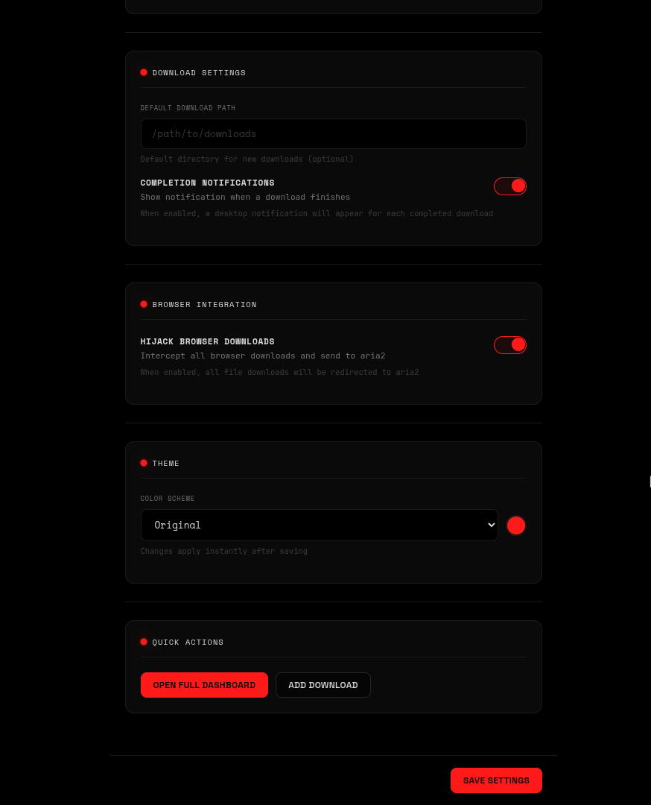
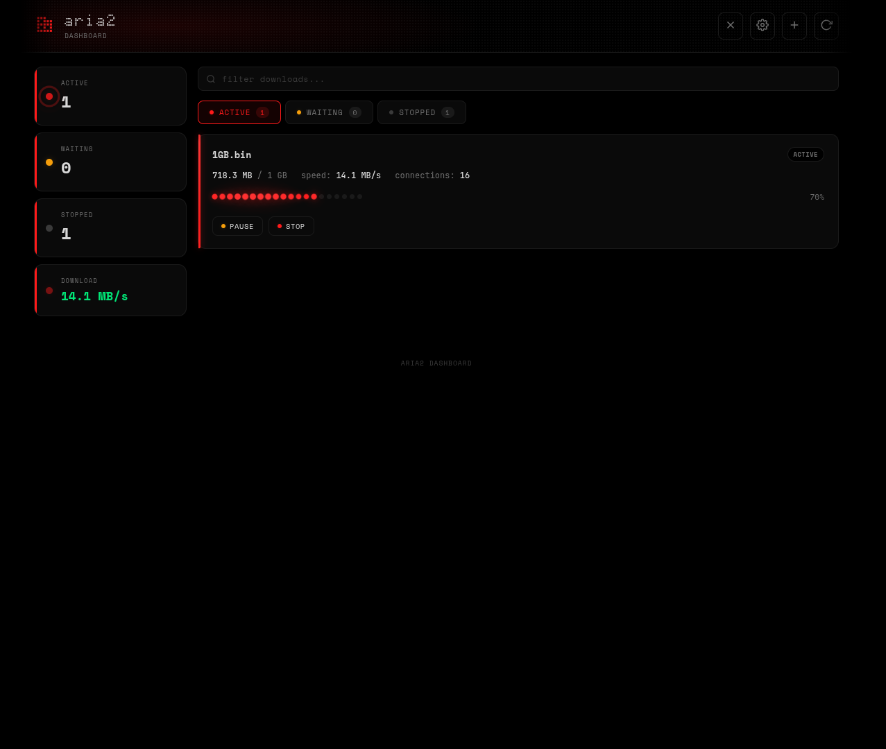

# Aria2 Dashboard

A browser extension for managing aria2 downloads with a sleek dot-matrix aesthetic and real-time updates. Supports both Chrome and Firefox.









## Features

- **Real-Time Updates**: Live download progress, speed, and status — refreshes continuously via recursive polling
- **Download Management**: View, pause, resume, stop, and remove downloads
- **Queue Reordering**: Move waiting downloads up and down the queue
- **Browser Integration**: Hijack browser downloads and send them directly to aria2
- **Badge Notifications**: Active download count shown on the extension icon
- **Site Interception**: Auto-detect download URLs from 30+ file hosting sites (Gofile, 1Fichier, Pixeldrain, MediaFire, RapidGator, etc.)
- **Safe Mode**: Toggle to force single-connection downloads for rate-limited hosts — prevents 429 errors and connection drops
- **Safe Mode Site Management**: Add and remove sites from the safe mode list directly in the options UI — no code editing required
- **File Extension Filters**: Block specific file types (e.g., `.torrent`, `.exe`) from being captured — useful for files you want the browser to handle natively
- **Shared Options**: Popup and full dashboard share the same options page with tabbed navigation (General + Safe Mode + Filters)
- **Built-in Themes**: Choose from Original, Catppuccin, Dracula, Nord, and Tokyo Night themes
- **Custom Theme Editor**: Create and save your own themes with custom accent, amber, and status colors
- **Dark & Light Mode**: Every theme supports both dark and light variants
- **Dot-Matrix Aesthetic**: Monospace fonts (Doto, Space Mono, Space Grotesk), fluid animations (liquid progress bars, sonar rings, spring row entrances, ambient glows)
- **Toggleable Hijacking**: Enable/disable browser download interception
- **RPC Authentication**: Support for aria2 secret tokens
- **Cookie Forwarding**: Automatically sends cookies and referrer to aria2 for authenticated downloads

## Installation

### Windows 11 — one-click setup (recommended)

On Windows you don't need to install anything by hand. In the repo folder:

1. Double-click **`windows\Setup.bat`** (runs as your normal user — no admin needed)

The script takes care of everything:

1. Downloads the official aria2 Windows build into `%USERPROFILE%\aria2` and adds it to your PATH
2. Writes an `aria2.conf` with RPC enabled on port 6800 and a freshly generated secret
3. Registers aria2 to auto-start hidden in the background on login (Startup folder) and starts it right away
4. Installs Node.js if it's missing (via winget, or a portable copy as fallback), runs `npm install` and builds the Chrome extension into `dist\chrome`
5. Opens `chrome://extensions` and copies the extension folder path to your clipboard

Then finish the one-time extension load (unpacked extensions persist across Chrome restarts):

1. In `chrome://extensions`, turn on **Developer mode**
2. Click **Load unpacked** and select the `dist\chrome` folder (the path is already on your clipboard)
3. Open the extension options and paste the **Secret token** printed by the setup (the RPC URL is already the default `http://localhost:6800/jsonrpc`)

Day-to-day control: double-click **`windows\aria2.bat`** for a menu — start / stop / restart / status + connection test / log / edit conf / show secret. It can also be called from a terminal: `windows\aria2.bat start|stop|restart|status|log|conf|secret|rpc`.

Notes:

- Re-running `windows\Setup.bat` is safe: it keeps your existing config and secret.
- aria2 only listens on `localhost:6800` (`rpc-listen-all=false`), so no Windows Firewall prompt appears.
- The download queue survives reboots (`save-session`), and downloads go to your `Downloads` folder by default (`dir=` in `aria2.conf`).
- To remove everything again: `windows\Uninstall.bat` (leaves your project folder untouched).

Advanced (from a terminal, in the repo root):

```powershell
powershell -ExecutionPolicy Bypass -File windows\setup.ps1 -Rebuild        # force npm install + rebuild
powershell -ExecutionPolicy Bypass -File windows\setup.ps1 -Secret my-token
powershell -ExecutionPolicy Bypass -File windows\setup.ps1 -SkipBuild      # aria2/service only, no Node
powershell -ExecutionPolicy Bypass -File windows\uninstall.ps1             # remove the background service
```

### Chrome


1. Clone this repository
2. Run `npm install`
3. Run `npm run build:chrome`
4. Open Chrome and go to `chrome://extensions/`
5. Enable "Developer mode"
6. Click "Load unpacked"
7. Select the `dist/chrome` directory

### Firefox

1. Clone this repository
2. Run `npm install`
3. Run `npm run build:firefox`
4. Open Firefox and go to `about:debugging`
5. Click "This Firefox" → "Load Temporary Add-on"
6. Select the `dist/firefox/manifest.json` file

**Note:** Firefox temporary add-ons are removed when the browser closes. For permanent installation, the extension needs to be signed by Mozilla and distributed via [AMO](https://addons.mozilla.org/).

### From Release

1. Download a release ZIP from the releases page
2. Extract it
3. Open Chrome `chrome://extensions/` or Firefox `about:debugging`
4. Enable "Developer mode" (Chrome) or "Load Temporary Add-on" (Firefox)
5. Load the extracted directory (Chrome) or its `manifest.json` (Firefox)

## Install aria2

### Quick Install (recommended)

Run the installer script — it detects your OS, installs aria2, and starts it with RPC enabled:

**Linux / macOS:**
```bash
./scripts/install-aria2.sh
```

**Windows 11:**
Use `windows\Setup.bat` (see [Windows 11 — one-click setup](#windows-11--one-click-setup-recommended)) — it installs aria2, registers it as a background service *and* builds the extension. If you only want the bare aria2 installer, the legacy script still works:

```powershell
.\scripts\install-aria2.ps1
```

You can pass a custom RPC secret as an argument:
```bash
./scripts/install-aria2.sh my-secret-token
```
```powershell
.\install-aria2.ps1 my-secret-token
```

The script will:
1. Detect your package manager (apt, pacman, dnf, brew) or download the Windows binary from GitHub
2. Install aria2
3. Start aria2 with RPC on port 6800
4. Print the RPC URL and secret to use in the extension

### Manual Install

If you prefer to install manually:

**Linux:**

- Arch Linux / CachyOS:
  ```bash
  sudo pacman -S aria2
  ```
- Debian / Ubuntu:
  ```bash
  sudo apt update && sudo apt install -y aria2
  ```
- Fedora:
  ```bash
  sudo dnf install -y aria2
  ```

**macOS:**

Install with Homebrew:
```bash
brew install aria2
```

**Windows:**

- Install with Winget:
  ```powershell
  winget install aria2.aria2
  ```
- Or with Chocolatey:
  ```powershell
  choco install aria2
  ```
- Or download from [GitHub releases](https://github.com/aria2/aria2/releases)

### Start aria2 with RPC enabled (required)

Quick start:
```bash
aria2c --enable-rpc --rpc-listen-all=false --rpc-listen-port=6800 --rpc-secret="change-me"
```

- Extension default RPC URL: `http://localhost:6800/jsonrpc`
- Put the same secret in extension options (`Secret Token`)

To auto-start aria2 on login, add the command above (with `-D` for daemon mode) to your shell profile on Linux/macOS. On Windows, `windows\Setup.bat` registers this for you automatically (hidden, via the Startup folder).

Optional persistent config (`aria2.conf`):
```ini
enable-rpc=true
rpc-listen-all=false
rpc-listen-port=6800
rpc-secret=change-me
```

Then start aria2 with:
```bash
aria2c --conf-path=/path/to/aria2.conf
```

## Configuration

1. Make sure aria2 is running with RPC enabled:
   ```bash
   aria2c --enable-rpc --rpc-listen-all=false --rpc-listen-port=6800
   ```

2. Click the extension icon and open Options
3. Set your RPC URL (default: `http://localhost:6800/jsonrpc`)
4. Enter your secret token if configured
5. Test the connection

### Safe Mode

When enabled (default), downloads from known restrictive file hosts are sent to aria2 with:
- `max-connection-per-server: 1` — single connection to avoid rate limits
- `split: 1` — no chunk splitting
- `enable-http-pipelining: false` — prevents connection drops on some CDNs

This prevents 429 (Too Many Requests) errors and connection drops that occur when aria2's optimized multi-connection settings hammer rate-limited servers.

#### Managing Safe Mode Sites

Safe mode sites are managed through the options page:

1. Open the extension options (gear icon from popup, or from the full dashboard)
2. Switch to the **Safe Mode** tab
3. Toggle safe mode on/off
4. View all sites currently in the safe mode list
5. Add new sites by typing a domain (e.g. `example.com`) and clicking "add" or pressing Enter
6. Remove sites by clicking the X button on any site chip

Changes take effect immediately — no need to save or reload.

To add a new site for content script interception (auto-detecting download URLs), you still need to add a regex pattern to `siteInterceptors` in `src/content.js`. However, adding a domain to the safe mode list only requires the options UI — if you're already intercepting the URL through hijack or context menu, safe mode will apply automatically.

### File Extension Filters

File extension filters let you exclude specific file types from being captured by aria2. When a filter is active, downloads matching the extension will be ignored by:
- Browser download hijacking
- Content script interception
- Context menu "Download with aria2"
- Manual "Add Download"

This is useful for file types you want the browser to handle natively instead of sending to aria2.

#### Managing Filters

Filters are managed through the options page:

1. Open the extension options (gear icon from popup, or from the full dashboard)
2. Switch to the **Filters** tab
3. Type a file extension (e.g. `.torrent`, `.exe`, `.zip`) and click "add" or press Enter
4. Extensions are normalized with a leading dot and stored lowercase
5. Remove filters by clicking the X button on any filter chip

Changes take effect immediately — no need to save or reload.

⚠ **Note:** Filtering happens on the URL pathname. URLs without a recognizable file extension in the path (e.g., API-generated downloads) cannot be filtered. For those cases, use the "Hijack Downloads" toggle to selectively disable interception.

## Usage

### Popup Panel
- Quick view of active and waiting downloads
- Compact stats (active, waiting, speed)
- Toggle download hijacking
- Action buttons for each download (pause, resume, stop, reorder)
- Gear icon opens the shared options page in a new tab

### Full Dashboard
- Complete download management
- Tabbed interface (active/waiting/stopped)
- Reorder waiting downloads (move up/down in queue)
- Gear icon opens embedded options panel (General + Safe Mode + Filters + Themes tabs)
- Real-time updates

### Options Page
- **General tab**: RPC URL, secret token, download path, notification toggle, hijack toggle, theme selector, save settings
- **Safe Mode tab**: Safe mode toggle, managed sites list with add/remove
- **Filters tab**: File extension filter list with add/remove — block specific file types from being captured
- **Themes tab**: Built-in theme previews, custom theme list with create/edit/delete
- Accessible from popup (gear icon), full dashboard (gear icon), or `chrome://extensions` → options

### Download Hijacking
Enable "Hijack Downloads" to intercept browser downloads and send them to aria2 automatically.

**How it works:**
- Uses the downloads API to intercept browser downloads
- Content script monitors fetch/XHR responses for hidden download URLs from file hosting sites
- Extracts cookies and forwards them to aria2
- Sends referrer and cookie headers so authenticated sites (e.g. Gofile) work correctly
- Right-click any link and select "Download with aria2"

### Supported File Hosts (Site Interception)

The content script scans fetch/XHR responses for download URLs from these hosts:

1Fichier, Bowfile, Chomikuj, ClickNUpload, DailyUploads, DataNodes, DayUploads, DL.Free, DownMediaLoad, FileBin, FileDitch, FreedLink, Gofile, HexLoad, 1CloudFile, MediaFire, Mega, MegaUp, MixDrop, NitroFlare, Oshi.at, osu!ppy, Pixeldrain, RapidGator, Ranoz, SwissTransfer, Tmpfiles, UploadNow, UsersDrive, VikingFile, WDHO

## Building

### Prerequisites

- [Node.js](https://nodejs.org/) (v18 or later)
- npm (ships with Node.js)

### Quick Build

Run the build script to install dependencies and package for both browsers:
```bash
./scripts/build.sh
```

This runs `npm install` (if needed), builds with Vite for both Chrome and Firefox, then creates:
- `dist/aria2-dashboard-chrome.zip`
- `dist/aria2-dashboard-firefox.zip`

### Manual Build

```bash
npm install
npm run build:chrome   # Build for Chrome only
npm run build:firefox  # Build for Firefox only
npm run dev            # Vite dev server with HMR
npm run typecheck      # TypeScript type checking
```

## File Structure

```
├── src/                       # Source code
│   ├── entries/               # Entry points (HTML + TS bootstraps)
│   │   ├── popup.html         # Popup panel entry
│   │   ├── options.html       # Options page entry
│   │   ├── full.html          # Full dashboard entry
│   │   ├── options.ts         # Options bootstrap script
│   │   └── full.ts            # Dashboard bootstrap script
│   ├── components/            # Lit web components
│   │   ├── aria2-dashboard.ts # Full dashboard component
│   │   ├── aria2-popup.ts     # Popup component
│   │   ├── aria2-options.ts   # Options page component
│   │   ├── aria2-download-row.ts  # Download row component
│   │   ├── aria2-chip-list.ts # Filter chip component
│   │   ├── aria2-theme-editor.ts # Custom theme editor
│   │   └── aria2-logo.ts      # SVG logo component
│   ├── lib/                   # Shared TypeScript libraries
│   │   ├── constants.ts       # Type-safe constants & theme definitions
│   │   ├── shared.ts          # Shared utilities (RPC, config, formatting)
│   │   └── theme.ts           # Theme engine (apply, toggle, custom themes)
│   ├── styles/                # CSS
│   │   ├── theme.css          # Design tokens — colors, fonts, radii
│   │   └── shared.css         # Structural styles (references theme.css only)
│   ├── background.js          # Service worker / Background script
│   ├── content.js             # Content script for site-specific URL interception
│   └── constants.js           # Vanilla JS constants (imported by background)
├── chrome/                    # Chrome-specific files
│   └── manifest.json          # Chrome manifest source (copied by Vite to dist/)
├── firefox/                   # Firefox-specific files
│   ├── manifest.json          # Firefox manifest (with gecko settings)
│   └── icons/                 # Copy of extension icons
├── icons/                     # Extension icons
├── scripts/                   # Helper scripts
│   ├── build.sh               # npm install + build both browsers + zips
│   ├── install-aria2.sh       # aria2 installer (Linux/macOS)
│   └── install-aria2.ps1      # aria2 installer (Windows, legacy — aria2 only)
├── windows/                   # Windows 11 one-click setup
│   ├── Setup.bat              # double-click: full setup (aria2 + background service + build)
│   ├── setup.ps1              # setup engine
│   ├── aria2.bat              # double-click: start/stop/status menu
│   ├── aria2.ps1              # manager engine (also: aria2.ps1 start|stop|status|...)
│   ├── Uninstall.bat          # double-click: remove the background service
│   └── uninstall.ps1          # uninstall engine
├── docs/                      # README screenshots (sc1.png – sc4.png)
├── vite.config.ts             # Vite build configuration
├── tsconfig.json              # TypeScript configuration
├── package.json               # npm package definition
└── dist/                      # Build output (gitignored)
    ├── chrome/                # Chrome unpacked build
    ├── firefox/               # Firefox unpacked build
    ├── aria2-dashboard-chrome.zip
    └── aria2-dashboard-firefox.zip
```

### Chrome vs Firefox Differences

| Aspect | Chrome | Firefox |
|--------|--------|---------|
| Background | Service worker (`background.service_worker`) | Background page (`background.scripts`) |
| Download capture | `onChanged` + `onDeterminingFilename` | `onCreated` directly |
| Manifest | `chrome/manifest.json` → `dist/chrome/manifest.json` | `firefox/manifest.json` → `dist/firefox/manifest.json` |
| Add-on ID | N/A | `browser_specific_settings.gecko` |

Both versions use the same shared `src/background.js` and `src/content.js` — the build system (Vite) handles copying the appropriate manifest and icons for each target.

## Permissions

- `storage`: Save settings and safe mode host list
- `activeTab`: Browser integration
- `contextMenus`: Right-click download option
- `notifications`: Download status notifications
- `downloads`: Download interception
- `cookies`: Access cookies for authenticated downloads
- `host_permissions`: Connect to aria2 RPC and access cookies from all sites

## License

MIT

## Troubleshooting

### Downloads failing on certain sites
- Enable **Safe Mode** in options — this forces single-connection downloads for known restrictive hosts
- Make sure the site is in the safe mode list (Options → Safe Mode tab). Add it if missing
- Try using the context menu (right-click → "Download with aria2")
- Ensure the "Hijack Downloads" toggle is enabled
- Check that aria2 is running and connected

### Downloads going to wrong directory
- Set the download path in the extension options page
- If empty, aria2 uses its own `dir` config from `aria2.conf`

### aria2 not connecting
- Ensure aria2 is running with RPC enabled: `aria2c --enable-rpc`
- Check the RPC URL in extension options (default: `http://localhost:6800/jsonrpc`)
- Verify firewall settings allow connections to the RPC port

### "Windows Script Host: can not find script file ... start-aria2-hidden.vbs" at login
- The Startup shortcut exists but the hidden launcher script is missing — older
  setups skipped writing it whenever aria2 was already running during setup
- Re-run `windows\Setup.bat` — it now always (re)creates the launcher, re-points
  the Startup shortcut, and removes stale aria2 startup entries from old installs
- Quick check: `dir "%USERPROFILE%\aria2"` should list `aria2c.exe`, `aria2.conf`,
  `aria2.session` and `start-aria2-hidden.vbs`

### Badge not updating
- Badge shows the active download count and updates when the popup or full dashboard is open
- Close and reopen the popup to trigger a refresh if the count seems stale

## Credits

- Fonts: Doto, Space Mono, Space Grotesk (Google Fonts)
- Aria2: [aria2/aria2](https://github.com/aria2/aria2)
